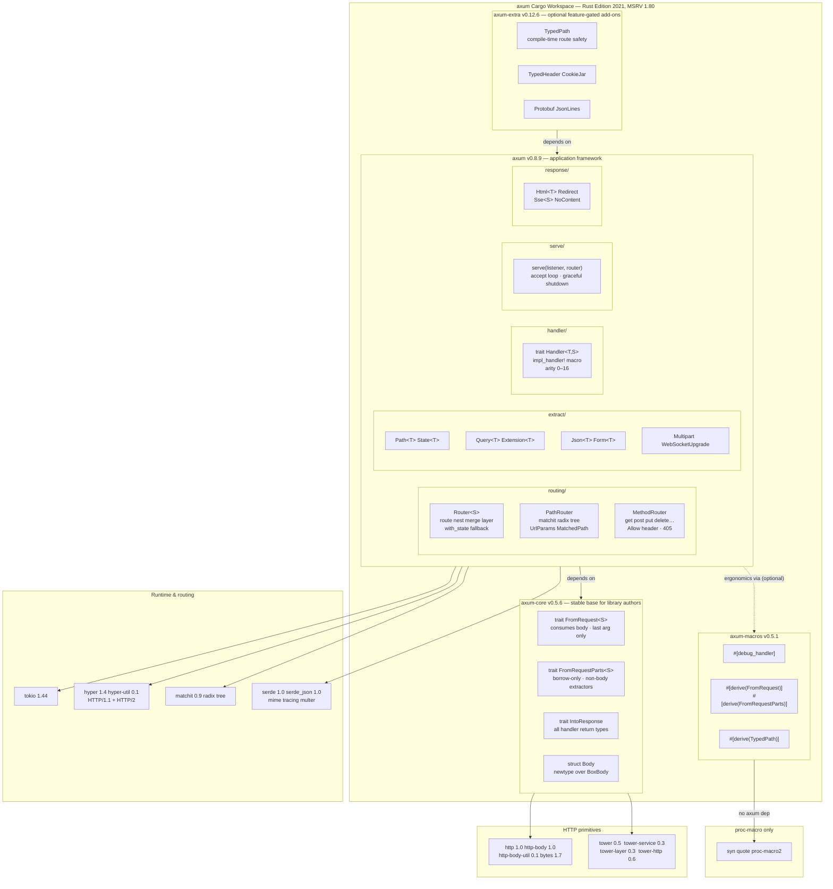
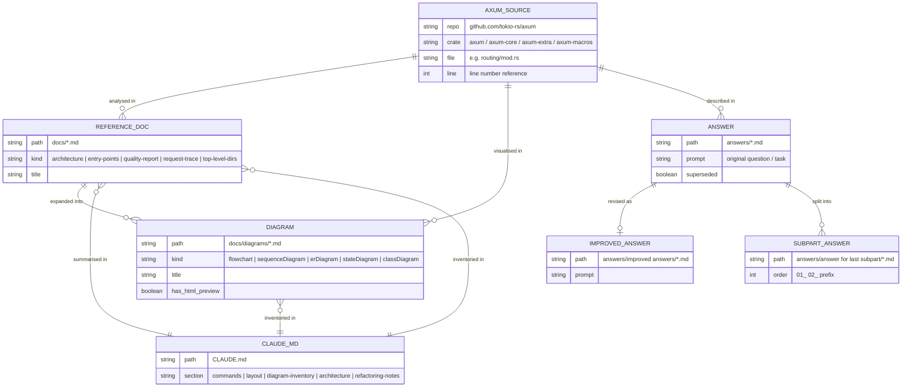

# axum Analysis Project — Mermaid Diagrams

Three diagrams covering angles not yet in `docs/diagrams/`: workspace code
organisation, route registration build-time flow, and the project's own
document structure.

---

## 1. Architecture — Workspace & Crate Dependency Map

How the four published crates are organised, what each exports, and which
external crates they pull in.



---

## 2. Sequence — Route Registration (Build Time)

How `.route()`, `.layer()`, and `.with_state()` build the internal data
structures **before** the first request arrives. Complements the existing
request-handling sequence diagrams.

```mermaid
sequenceDiagram
    autonumber
    participant App  as Application code
    participant R    as Router&lt;S&gt;
    participant RI   as RouterInner&lt;S&gt;
    participant PR   as PathRouter&lt;S&gt;
    participant Node as Node (matchit)
    participant MR   as MethodRouter&lt;S&gt;

    App  ->>  R:    Router::new()
    R    ->>  RI:   RouterInner { path_router: default, default_fallback: true }
    RI   ->>  PR:   PathRouter { routes: [], node: empty }
    R    -->> App:  Router&lt;S&gt; (empty)

    App  ->>  R:    .route("/users", get(handler))
    R    ->>  RI:   into_inner() — Arc::try_unwrap or clone
    RI   ->>  PR:   route("/users", MethodRouter)
    PR   ->>  PR:   validate_path("/users")
    PR   ->>  Node: insert("/users", RouteId(0))
    Note over Node: matchit radix tree stores\n"/users" → RouteId(0)
    PR   ->>  PR:   routes.push(Endpoint::MethodRouter(mr))
    Note over MR:   MethodEndpoint::BoxedHandler stored\n(state S not yet known)
    R    -->> App:  Router&lt;S&gt; with one route

    App  ->>  R:    .route("/users/{id}", get(get_user))
    R    ->>  PR:   route("/users/{id}", MethodRouter)
    PR   ->>  Node: insert("/users/{id}", RouteId(1))
    PR   ->>  PR:   routes.push(Endpoint::MethodRouter(mr2))
    R    -->> App:  Router&lt;S&gt; with two routes

    App  ->>  R:    .layer(TraceLayer)
    R    ->>  PR:   layer(TraceLayer)
    PR   ->>  PR:   map each Endpoint through layer.layer(route)
    Note over PR:   Every Route is now wrapped:\nTraceLayer(Route(handler))
    R    -->> App:  Router&lt;S&gt; with layered routes

    App  ->>  R:    .with_state(app_state)
    R    ->>  RI:   PathRouter::with_state(state)
    loop  each Endpoint::MethodRouter in routes
        RI   ->>  MR:   with_state(state.clone())
        MR   ->>  MR:   BoxedHandler.into_route(state)\nBoxedHandler → Route
        Note over MR:   State baked in. MethodEndpoint::BoxedHandler\nbecomes MethodEndpoint::Route
    end
    R    -->> App:  Router&lt;()&gt; — ready for axum::serve()

    App  ->>  R:    axum::serve(listener, router)
    Note over R:    IntoMakeService clones Router&lt;()&gt;\nonce per accepted TCP connection
```

---

## 3. ER — Project Document Structure

Entity-relationship map of the analysis project's own files: how document
types relate to each other and to the external axum source they describe.


