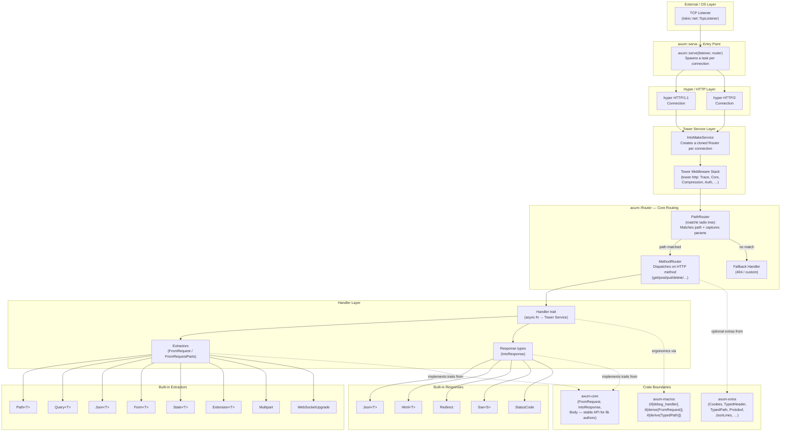

# axum — Architecture Flowchart

System layers from the network edge down to user-defined application logic.

```mermaid
flowchart TD
    subgraph External["External / OS Layer"]
        TCP["TCP Listener\n(tokio::net::TcpListener)"]
    end

    subgraph Serve["axum::serve — Entry Point"]
        SERVE["axum::serve(listener, router)\nSpawns a task per connection"]
    end

    subgraph Hyper["Hyper / HTTP Layer"]
        H1["hyper HTTP/1.1\nConnection"]
        H2["hyper HTTP/2\nConnection"]
    end

    subgraph Tower["Tower Service Layer"]
        direction TB
        MakeService["IntoMakeService\nCreates a cloned Router per connection"]
        MW["Tower Middleware Stack\n(tower-http: Trace, Cors,\nCompression, Auth, …)"]
    end

    subgraph Router["axum::Router — Core Routing"]
        direction TB
        PR["PathRouter\n(matchit radix tree)\nMatches path + captures params"]
        MR["MethodRouter\nDispatches on HTTP method\n(get/post/put/delete/…)"]
        FB["Fallback Handler\n(404 / custom)"]
    end

    subgraph Handler["Handler Layer"]
        direction TB
        HT["Handler trait\n(async fn → Tower Service)"]
        EX["Extractors\n(FromRequest / FromRequestParts)"]
        RES["Response types\n(IntoResponse)"]
    end

    subgraph Extractors["Built-in Extractors"]
        direction LR
        PATH["Path&lt;T&gt;"]
        QUERY["Query&lt;T&gt;"]
        JSON["Json&lt;T&gt;"]
        FORM["Form&lt;T&gt;"]
        STATE["State&lt;T&gt;"]
        EXT["Extension&lt;T&gt;"]
        MP["Multipart"]
        WS["WebSocketUpgrade"]
    end

    subgraph Responses["Built-in Responses"]
        direction LR
        RJSON["Json&lt;T&gt;"]
        HTML["Html&lt;T&gt;"]
        REDIR["Redirect"]
        SSE["Sse&lt;S&gt;"]
        STATUS["StatusCode"]
    end

    subgraph Crates["Crate Boundaries"]
        CORE["axum-core\n(FromRequest, IntoResponse,\nBody — stable API for lib authors)"]
        MACROS["axum-macros\n(#[debug_handler],\n#[derive(FromRequest)],\n#[derive(TypedPath)])"]
        EXTRA["axum-extra\n(Cookies, TypedHeader,\nTypedPath, Protobuf,\nJsonLines, …)"]
    end

    TCP --> SERVE
    SERVE --> H1
    SERVE --> H2
    H1 --> MakeService
    H2 --> MakeService
    MakeService --> MW
    MW --> PR
    PR -->|"path matched"| MR
    PR -->|"no match"| FB
    MR --> HT
    HT --> EX
    EX --> PATH & QUERY & JSON & FORM & STATE & EXT & MP & WS
    HT --> RES
    RES --> RJSON & HTML & REDIR & SSE & STATUS
    EX -.->|"implements traits from"| CORE
    RES -.->|"implements traits from"| CORE
    HT -.->|"ergonomics via"| MACROS
    MR -.->|"optional extras from"| EXTRA
```
