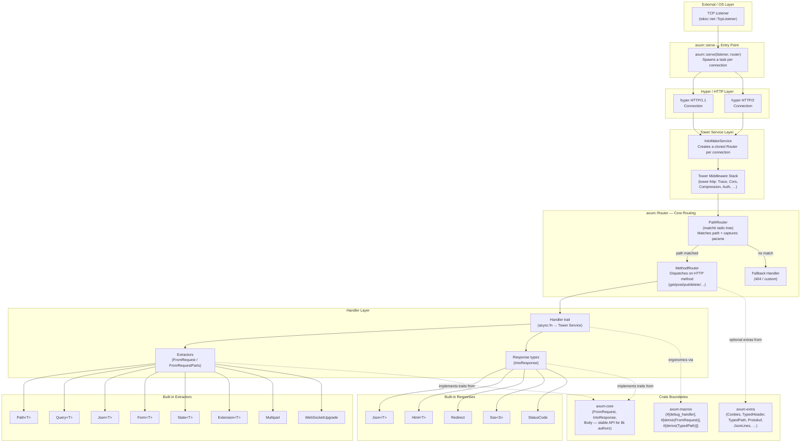

# axum — Repository Architecture

## Tech stack

| Layer | Technology | Version |
|---|---|---|
| Language | Rust | Edition 2021, MSRV 1.80 |
| Async runtime | Tokio | 1.44 |
| HTTP protocol | Hyper | 1.4.0 (HTTP/1.1 + HTTP/2) |
| Service abstraction | Tower | 0.5.2 |
| HTTP middleware | tower-http | 0.6.8 |
| Path matching | matchit | 0.9.2 (radix tree) |
| Serialisation | serde + serde_json | 1.0.221 / 1.0.29 |
| Unsafe policy | **Forbidden** | workspace-wide compiler lint |

---

## Workspace crates

The repository is a Cargo workspace (`Cargo.toml` at the root) containing four published crates arranged in a strict dependency hierarchy:

```
axum-macros          (proc-macros only, no axum deps)
      ↑
axum-core            (traits + Body, no axum dep)
      ↑
axum                 (router, handlers, extractors, serve)
      ↑
axum-extra           (optional add-ons, depends on axum)
```

### `axum/` — `axum/src/lib.rs`
The main framework crate (v0.8.9). Everything a typical application imports.
Contains `Router`, all built-in extractors, middleware helpers, response types,
WebSocket support, and the `serve()` entry point.

### `axum-core/` — `axum-core/src/lib.rs`
Minimal foundation for library and middleware authors (v0.5.6). Defines the core
traits `FromRequest`, `FromRequestParts`, `IntoResponse`, and the `Body` newtype.
Versioned separately from `axum` to keep the ecosystem stable — breaking changes
here affect every crate that builds on axum.

### `axum-extra/` — `axum-extra/src/lib.rs`
Optional batteries (v0.12.6), all feature-gated. Typed cookies, typed HTTP
headers (`headers` crate), `TypedPath` compile-time route checking, Protobuf
support, JSON Lines streaming, and additional routing/middleware utilities.

### `axum-macros/` — `axum-macros/src/lib.rs`
Procedural macro crate (v0.5.1). Provides `#[debug_handler]` (better compile
errors on handlers), `#[derive(FromRequest)]`, `#[derive(FromRequestParts)]`,
and `#[derive(TypedPath)]`. Has no dependency on `axum` itself — only `syn`,
`quote`, `proc-macro2`.

---

## Top-level directories

| Path | Role |
|---|---|
| `axum/` | Main crate source + `Cargo.toml` |
| `axum-core/` | Core traits crate source + `Cargo.toml` |
| `axum-extra/` | Optional extras crate source + `Cargo.toml` |
| `axum-macros/` | Proc-macro crate source + `Cargo.toml` |
| `examples/` | 50+ self-contained runnable example projects (JSON API, WebSocket, TLS, JWT, SSE, graceful shutdown, etc.) |
| `contrib/` | IDE tooling contributions (editor config, snippets) — not part of any published crate |
| `Cargo.toml` | Workspace manifest; declares all four crates as members and pins shared dependency versions and lint rules |
| `Cargo.lock` | Pinned dependency tree for reproducible builds |
| `deny.toml` | `cargo-deny` config: license allowlists, duplicate-crate bans, security advisory checks |
| `.clippy.toml` | Shared Clippy linter config applied across the entire workspace |
| `CHANGELOG.md` | Per-release history of breaking changes, additions, fixes |

---

## Key modules inside `axum/src/`

| File / Directory | Role |
|---|---|
| `lib.rs` | Public re-export surface — every symbol a user imports flows through here |
| `routing/mod.rs` | `Router<S>` struct, route composition, `.with_state()`, `.nest()`, `.merge()`, `.layer()`, fallback logic |
| `routing/path_router.rs` | `PathRouter` — owns the matchit radix tree, maps `RouteId` → `MethodRouter` or `Route` |
| `routing/method_routing.rs` | `MethodRouter` — dispatches on HTTP method via a `call!` macro; builds `get()`, `post()`, `put()`, … helpers |
| `routing/route.rs` | `Route` — type-erased Tower `Service` wrapper for a single endpoint |
| `extract/mod.rs` | Re-exports all built-in extractors |
| `extract/path/mod.rs` | `Path<T>` — deserialises URL captures via `serde` |
| `extract/query.rs` | `Query<T>` — deserialises query-string via `serde` |
| `extract/state.rs` | `State<T>` — reads shared app state from `Request::extensions` |
| `extract/ws.rs` | `WebSocketUpgrade` — HTTP → WebSocket upgrade handshake |
| `extract/multipart.rs` | `Multipart` — streaming multipart/form-data parser |
| `handler/mod.rs` | `Handler` trait + `impl_handler!` macro generating blanket impls for arity 0–16 |
| `handler/service.rs` | `HandlerService` — wraps a `Handler` as a reusable Tower `Service` |
| `middleware/from_fn.rs` | `from_fn` — build Tower middleware from a plain `async fn` |
| `middleware/map_request.rs` | `MapRequest` — transform the request before the handler |
| `middleware/map_response.rs` | `MapResponse` — transform the response after the handler |
| `response/mod.rs` | `Html<T>`, `NoContent`, re-exports of `IntoResponse` |
| `response/sse.rs` | `Sse<S>` — Server-Sent Events streaming response |
| `response/redirect.rs` | `Redirect` — 3xx response helpers |
| `serve/mod.rs` | `axum::serve()` — accept loop, per-connection task spawning, graceful shutdown |
| `body/mod.rs` | `Body` newtype wrapping hyper `Incoming`; `to_bytes` utility |
| `json.rs` | `Json<T>` extractor (deserialise) + response (serialise), behind `json` feature |
| `form.rs` | `Form<T>` extractor for `application/x-www-form-urlencoded` |
| `error_handling/mod.rs` | `HandleError` Tower layer — converts service errors into HTTP responses |
| `test_helpers/` | `TestClient` for integration tests without a real TCP socket |

---

## Public entry points

### `axum::serve()` — `axum/src/serve/mod.rs:103`
```rust
pub fn serve<L, M, S, B>(listener: L, make_service: M) -> Serve<…>
```
Starts the HTTP server. Accepts a `tokio::net::TcpListener` and a `Router<()>`.
Drives `hyper_util::server::conn::auto::Builder` (HTTP/1 + HTTP/2) and spawns
one Tokio task per accepted connection.

### `Router<S>` — `axum/src/routing/mod.rs:86`
```rust
pub struct Router<S = ()>
```
The primary application-builder type. `S` is the *missing* state — only
`Router<()>` (state already provided via `.with_state(s)`) can be passed to
`serve()`. Key methods: `.route()`, `.nest()`, `.merge()`, `.layer()`,
`.route_layer()`, `.fallback()`, `.with_state()`.

### Method helpers — `axum/src/routing/method_routing.rs`
```rust
pub use method_routing::{get, post, put, delete, patch, head, options, trace, any, on};
```
Each returns a `MethodRouter` accepted by `Router::route`. The argument is any
async function whose parameters implement `FromRequest`/`FromRequestParts` and
whose return type implements `IntoResponse`.

### `Handler` trait — `axum/src/handler/mod.rs:100`
```rust
pub trait Handler<T, S>: Clone + Send + Sized + 'static {
    fn call(self, req: Request, state: S) -> Self::Future;
}
```
Blanket-implemented for all async functions of arity 0–16.

### `FromRequest` / `FromRequestParts` — `axum-core/src/extract/mod.rs`
Core extractor traits. Implement `FromRequestParts` for extractors that do not
consume the body (safe to run on `&mut Parts`); implement `FromRequest` for
extractors that may consume the body (must be the last argument in a handler).

### `IntoResponse` — `axum-core/src/response/mod.rs`
```rust
pub trait IntoResponse {
    fn into_response(self) -> Response;
}
```
Implemented for tuples, `Json<T>`, `Html<T>`, `String`, `Bytes`, `StatusCode`,
`Result<T, E>`, and more.

---

## External dependencies

### Runtime and HTTP

| Crate | Version | Role |
|---|---|---|
| `tokio` | 1.44 | Async runtime, `TcpListener`, timers, `sync::watch` |
| `hyper` | 1.4.0 | HTTP/1.1 + HTTP/2 protocol implementation |
| `hyper-util` | 0.1.4 | `TowerToHyperService`, `auto::Builder`, `TokioIo` |
| `tower` | 0.5.2 | `Service` + `Layer` abstractions; `ServiceExt` |
| `tower-service` | 0.3 | `Service` trait |
| `tower-layer` | 0.3.2 | `Layer` trait |
| `tower-http` | 0.6.8 | Ready-made HTTP middleware: Trace, CORS, Compression, Auth |

### HTTP types

| Crate | Version | Role |
|---|---|---|
| `http` | 1.0.0 | `Request`, `Response`, `Method`, `StatusCode`, `HeaderMap`, `Uri` |
| `http-body` | 1.0.0 | `Body` trait |
| `http-body-util` | 0.1.0 | `BodyExt`, `Limited`, `Empty`, `Full` |
| `bytes` | 1.7 | Zero-copy `Bytes` / `BytesMut` |

### Routing and serialisation

| Crate | Version | Role |
|---|---|---|
| `matchit` | 0.9.2 | Radix-tree path matching with `{param}` and `{*wildcard}` |
| `serde` | 1.0.221 | Serialisation traits |
| `serde_json` | 1.0.29 | JSON — `Json<T>` extractor/response (`json` feature) |
| `serde_html_form` | 0.4.0 | HTML form decoding (`form` feature) |
| `mime` | 0.3.16 | MIME type parsing for `Content-Type` validation |
| `serde_path_to_error` | — | Wraps serde errors with the field path that failed |

### Async utilities

| Crate | Version | Role |
|---|---|---|
| `futures-core` | 0.3 | `Stream` + `Future` primitives |
| `futures-util` | 0.3 | `FutureExt`, `StreamExt` combinators |
| `pin-project-lite` | 0.2.7 | Safe `Pin` projection |
| `sync_wrapper` | 1.0.0 | Makes `!Send` types usable in `Send` contexts |
| `percent-encoding` | 2.1 | URL percent-encode/decode |

### Optional / feature-gated

| Crate | Feature | Role |
|---|---|---|
| `tokio-tungstenite` | `ws` | WebSocket upgrade |
| `sha1` + `base64` | `ws` | WebSocket handshake |
| `multer` | `multipart` | Multipart form-data parsing |
| `tracing` | `tracing` | Structured logging |

### Proc-macro crate only

| Crate | Role |
|---|---|
| `syn` 2.0 | Rust AST parsing |
| `quote` 1.0 | Token-stream code generation |
| `proc-macro2` 1.0 | Macro token stream API |

---

## Architecture flowchart

System layers from the network edge down to user-defined application logic.


