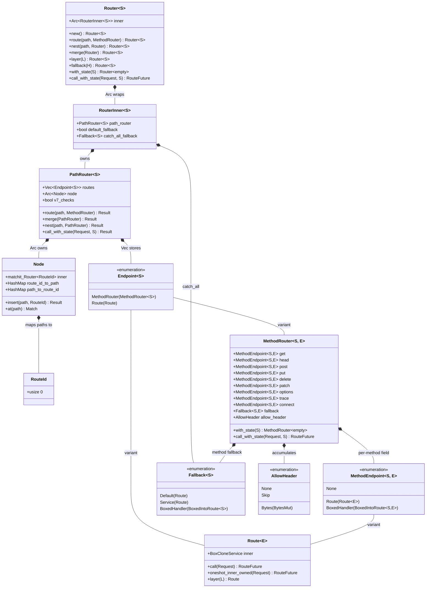

# axum — Class Diagram: Core Type and Trait Hierarchy

Ownership, composition, and trait-implementation relationships for the types
that matter most when reading or extending axum.

---

## 1. Routing Type Hierarchy

---

## 2. Trait System and Implementations

```mermaid
classDiagram
    direction TB

    class Service~Req~ {
        <<trait>>
        +Response type
        +Error type
        +Future type
        +poll_ready(Context) Poll~Result~
        +call(Req) Self.Future
    }

    class Layer~S~ {
        <<trait>>
        +Service type
        +layer(self, S) Self.Service
    }

    class Handler~T, S~ {
        <<trait>>
        +Future type
        +call(self, Request, S) Self.Future
    }

    class FromRequestParts~S~ {
        <<trait>>
        +Rejection IntoResponse
        +from_request_parts(Parts, S) Result~Self, Rejection~
    }

    class FromRequest~S~ {
        <<trait>>
        +Rejection IntoResponse
        +from_request(Request, S) Result~Self, Rejection~
    }

    class IntoResponse {
        <<trait>>
        +into_response(self) Response
    }

    class Router~empty~ {
        implements Service
    }

    class Route {
        implements Service
    }

    class HandlerService~H,T,S~ {
        +Handler~T,S~ handler
        +S state
        implements Service
    }

    class Path~T~ {
        +T 0
        reads UrlParams from extensions
        implements FromRequestParts
    }

    class Query~T~ {
        +T 0
        parses URI query string
        implements FromRequestParts
    }

    class State~T~ {
        +T 0
        reads T from extensions
        implements FromRequestParts
    }

    class Extension~T~ {
        +T 0
        reads T from extensions
        implements FromRequestParts
    }

    class Json~T~ {
        +T 0
        validates Content-Type
        buffers + deserialises body
        implements FromRequest
        implements IntoResponse
    }

    class Form~T~ {
        +T 0
        parses urlencoded body
        implements FromRequest
    }

    class Bytes {
        buffers entire body
        implements FromRequest
    }

    class Html~T~ {
        +T 0
        sets Content-Type text/html
        implements IntoResponse
    }

    class Redirect {
        +StatusCode status
        +Uri location
        implements IntoResponse
    }

    class StatusCode {
        implements IntoResponse
    }

    Router~empty~ ..|> Service~Request~ : impl when S = ()
    Route ..|> Service~Request~         : impl
    HandlerService~H,T,S~ ..|> Service~Request~ : impl
    Handler~T,S~ ..> HandlerService~H,T,S~ : converts to via .into_service()

    Path~T~ ..|> FromRequestParts~S~    : impl
    Query~T~ ..|> FromRequestParts~S~   : impl
    State~T~ ..|> FromRequestParts~S~   : impl
    Extension~T~ ..|> FromRequestParts~S~ : impl

    Json~T~ ..|> FromRequest~S~         : impl — consumes body
    Form~T~ ..|> FromRequest~S~         : impl — consumes body
    Bytes ..|> FromRequest~S~           : impl — consumes body

    Json~T~ ..|> IntoResponse           : impl — serialises to JSON
    Html~T~ ..|> IntoResponse           : impl
    Redirect ..|> IntoResponse          : impl
    StatusCode ..|> IntoResponse        : impl

    Handler~T,S~ ..> FromRequestParts~S~ : auto-extracts args via
    Handler~T,S~ ..> FromRequest~S~      : auto-extracts last arg via
    Handler~T,S~ ..> IntoResponse        : return type must impl

    Layer~S~ ..> Service~Req~            : wraps inner service
```

---

## Design notes

### Why `FromRequestParts` and `FromRequest` are separate traits

`FromRequestParts` borrows `&mut Parts` — multiple extractors can share
the same parts simultaneously (borrow checker allows it because they each
take a mutable reference in sequence, generated by the `impl_handler!` macro).
`FromRequest` consumes the whole `Request`, including the body stream, so
only one such extractor can exist per handler, and it must be the last argument.

### Why `MethodEndpoint` has a `BoxedHandler` variant

Handlers are registered with `Router::route()` before `.with_state(s)` is
called — at registration time the state type `S` is not yet `()`. The
`BoxedHandler(BoxedIntoRoute<S, E>)` variant stores the handler in a
type-erased box. When `with_state(s)` is called, every `BoxedHandler` is
converted to a fully-baked `Route` via `into_route(state)`, and the state
`S` disappears from the type.

### The `Router<S>` Arc pattern

`Router<S>` wraps `Arc<RouterInner<S>>` so that cloning is O(1) (one atomic
increment). Every builder method calls `into_inner()` which calls
`Arc::try_unwrap` — if the `Arc` is uniquely owned it avoids a clone; if not
(e.g. during `merge`) it clones the inner data exactly once.
