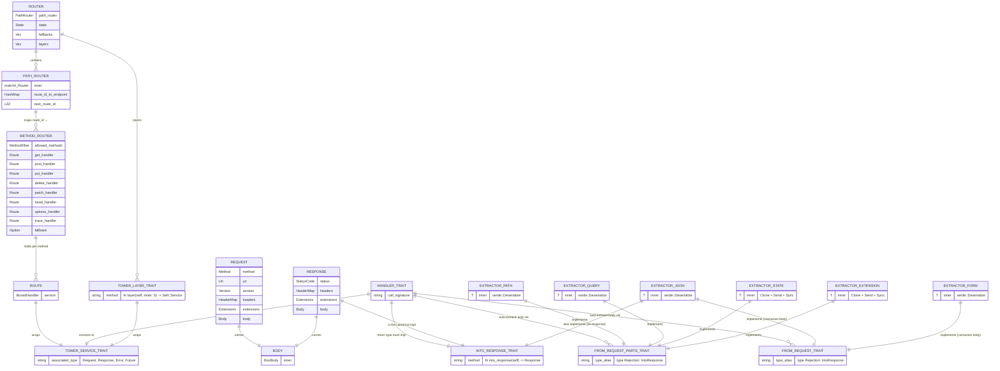

# axum — Core Type / Trait ER Diagram

axum is a framework, not a data-persistence layer, so it has no database schema.
This diagram maps the key **types and traits** and how they relate — the closest
equivalent of a data model in a framework codebase.

