# axum — Request Flow Architecture

How a single HTTP request travels through every layer of the axum stack,
with the responsible file path noted at each step.

## Flowchart

```mermaid
flowchart TD
    Client(["Client\nHTTP request"])

    subgraph OS["OS / Tokio"]
        TCP["tokio::net::TcpListener\n· accept() blocks until SYN\n· yields (TcpStream, SocketAddr)"]
    end

    subgraph Serve["axum/src/serve/mod.rs"]
        SRV["serve() L103\nbuilds Serve struct"]
        RUN["Serve::run() L321\ninfinte accept loop"]
        HC["handle_connection() L559\n· TokioIo wraps TcpStream\n· clones Router via MakeService\n· wraps in TowerToHyperService"]
    end

    subgraph HyperLayer["hyper-util — external"]
        AUTO["auto::Builder L603\nHTTP/1.1 or HTTP/2\nserve_connection_with_upgrades()"]
        PARSE["hyper: parse bytes\n→ Request&lt;Incoming&gt;"]
    end

    subgraph BodyWrap["axum/src/body/mod.rs"]
        BODY["Body::new() L594\nwraps Incoming → axum Body"]
    end

    subgraph TowerMW["Tower Middleware Stack\ntower-http / custom layers"]
        MW1["Layer N  e.g. TraceLayer"]
        MW2["Layer N-1  e.g. CorsLayer"]
        MWN["Layer 1  e.g. CompressionLayer\n(applied innermost-first)"]
    end

    subgraph RouterBlock["axum/src/routing/mod.rs"]
        RCALL["Router::call() L614\nService impl for Router&lt;()&gt;\n→ call_with_state(req, ())"]
    end

    subgraph PathMatch["axum/src/routing/path_router.rs"]
        PMATCH["PathRouter::call_with_state() L325\nmatchit node.at(uri.path()) L342\n→ radix-tree O(n) lookup"]
        PARAMS["url_params::insert_url_params() L353\nstores {id}/{*rest} captures\ninto Request::extensions"]
        MPATH["set_matched_path_for_request() L346\nstores '/users/:id' string\ninto Request::extensions\n(feature = matched-path)"]
    end

    subgraph MethodDisp["axum/src/routing/method_routing.rs"]
        MDISP["MethodRouter::call_with_state() L1167\nmacro call!(req, POST, post) L1193\nchecks req.method()"]
        MKROUTE["handler.clone().into_route(state)\n→ BoxedHandler → Route"]
        ONESHOT["route.oneshot_inner_owned(req)"]
    end

    subgraph HandlerBlock["axum/src/handler/mod.rs"]
        HCALL["Handler::call() L238\nimpl_handler! macro\nsplits req → (parts, body)"]
    end

    subgraph ExtractParts["FromRequestParts extractors\naxum-core/src/extract/mod.rs"]
        EP1["State&lt;T&gt;::from_request_parts()\naxum/src/extract/state.rs\nreads T from extensions"]
        EP2["Path&lt;T&gt;::from_request_parts()\naxum/src/extract/path/mod.rs\ndeserialises url_params"]
        EP3["Query&lt;T&gt;::from_request_parts()\naxum/src/extract/query.rs\nparses URI query string"]
        EP4["Extension&lt;T&gt;::from_request_parts()\naxum/src/extension.rs"]
        EPERR{{"Rejection?\n→ rejection.into_response()\nshort-circuit"}}
    end

    subgraph ExtractBody["FromRequest extractor (last arg only)\naxum-core/src/extract/mod.rs"]
        EB1["Json&lt;T&gt;::from_request()\naxum/src/json.rs L106\n· checks Content-Type L107\n· buffers body → Bytes L111\n· serde_json::from_slice L184"]
        EB2["Form&lt;T&gt;::from_request()\naxum/src/form.rs\n· serde_html_form decode"]
        EB3["Bytes::from_request()\nhttp-body-util buffer"]
        EB4["Multipart::from_request()\naxum/src/extract/multipart.rs\n· multer streaming parser"]
        EBERR{{"Rejection?\n→ rejection.into_response()\nshort-circuit"}}
    end

    subgraph UserFn["User-defined async fn"]
        UFN["await handler(arg1, arg2, …)\nreturns impl IntoResponse"]
    end

    subgraph ResponseConv["Response conversion\naxum-core/src/response/mod.rs"]
        IR["IntoResponse::into_response()\ne.g. Json&lt;T&gt;: axum/src/json.rs L201\n· serde_json::to_writer L229\n· sets Content-Type: application/json\ne.g. Html&lt;T&gt;: response/mod.rs\ne.g. Redirect: response/redirect.rs\ne.g. Sse&lt;S&gt;: response/sse.rs"]
    end

    subgraph MWPost["Tower Middleware (post-processing)"]
        MWP["Layers run in reverse\ne.g. compress body, add headers,\nrecord trace span duration"]
    end

    subgraph HyperOut["hyper-util — external"]
        FRAME["frame Response as HTTP bytes\nwrite to TokioIo socket"]
    end

    ClientOut(["Client\nHTTP response"])

    %% ── happy path ────────────────────────────────────────────────
    Client      --> TCP
    TCP         --> RUN
    RUN         --> HC
    HC          --> SRV
    HC          --> AUTO
    AUTO        --> PARSE
    PARSE       --> BODY
    BODY        --> MW1
    MW1         --> MW2
    MW2         --> MWN
    MWN         --> RCALL
    RCALL       --> PMATCH
    PMATCH      -->|"match found"| PARAMS
    PARAMS      --> MPATH
    MPATH       --> MDISP
    MDISP       -->|"method matched"| MKROUTE
    MKROUTE     --> ONESHOT
    ONESHOT     --> HCALL
    HCALL       --> EP1 & EP2 & EP3 & EP4
    EP1 & EP2 & EP3 & EP4 --> EPERR
    EPERR       -->|"ok"| EB1
    EPERR       -->|"ok"| EB2
    EPERR       -->|"ok"| EB3
    EPERR       -->|"ok"| EB4
    EB1 & EB2 & EB3 & EB4 --> EBERR
    EBERR       -->|"ok"| UFN
    UFN         --> IR
    IR          --> MWP
    MWP         --> FRAME
    FRAME       --> ClientOut

    %% ── error / fallback paths ────────────────────────────────────
    PMATCH      -->|"404 no match"| MWP
    MDISP       -->|"405 method not allowed"| MWP
    EPERR       -->|"rejection"| MWP
    EBERR       -->|"rejection"| MWP

    %% ── styles ───────────────────────────────────────────────────
    classDef layer   fill:#1f3a5f,stroke:#388bfd,color:#a5d6ff
    classDef extract fill:#1a3626,stroke:#3fb950,color:#7ee787
    classDef error   fill:#3d1c1c,stroke:#f85149,color:#ffa198
    classDef user    fill:#3d2200,stroke:#d29922,color:#e3b341
    classDef resp    fill:#2d1f63,stroke:#a371f7,color:#d2a8ff
    classDef extern  fill:#21262d,stroke:#484f58,color:#8b949e

    class MW1,MW2,MWN,MWP layer
    class EP1,EP2,EP3,EP4,EB1,EB2,EB3,EB4 extract
    class EPERR,EBERR error
    class UFN user
    class IR resp
    class AUTO,PARSE,FRAME,HyperOut extern
```

## Layer colour key

| Colour | Meaning |
|---|---|
| Blue nodes | Tower middleware layers (applied before and after routing) |
| Green nodes | Extractors (`FromRequestParts` and `FromRequest` implementations) |
| Red diamonds | Rejection short-circuit points — any failure here returns early |
| Yellow node | User-defined async handler function |
| Purple node | `IntoResponse` conversion |
| Grey nodes | External crates (hyper-util, OS) |

## Key design constraints visible in this flow

1. **`FromRequestParts` before `FromRequest`** — parts extractors share a `&mut Parts` borrow and run first; the body extractor runs last because it consumes the body (`axum/src/handler/mod.rs:239–252`).
2. **State lives in `Request::extensions`** — `Router::with_state()` inserts the state at startup; `State<T>::from_request_parts` reads it back with zero argument passing overhead.
3. **URL params live in `Request::extensions`** — `url_params::insert_url_params()` (`path_router.rs:353`) stores matchit captures; `Path<T>` reads them back without re-parsing the URI.
4. **Every rejection is a response** — `type Rejection: IntoResponse` means any extractor failure produces a valid HTTP response directly, with no `unwrap` or panic path.
5. **Tower middleware wraps the entire Router** — layers applied via `.layer()` see both the request (before routing) and the response (after the handler), in stack order.
