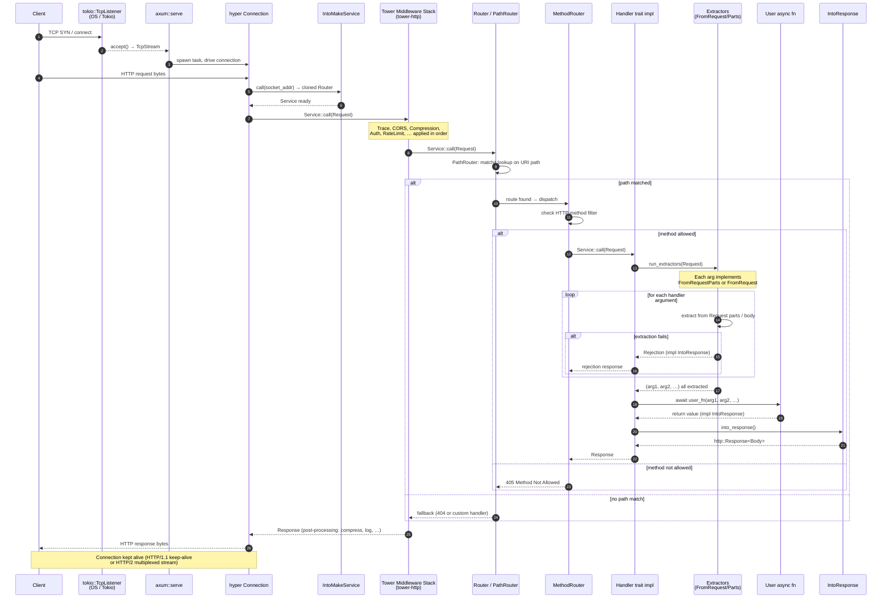

# axum — Request Lifecycle Sequence Diagram

Traces a single HTTP request from the TCP accept through routing, extraction,
handler execution, and response serialization back to the client.

```mermaid
sequenceDiagram
    autonumber
    participant Client
    participant TcpListener as tokio::TcpListener<br/>(OS / Tokio)
    participant Serve as axum::serve
    participant Hyper as hyper Connection
    participant MakeSvc as IntoMakeService
    participant MW as Tower Middleware Stack<br/>(tower-http)
    participant Router as Router / PathRouter
    participant MethodRouter as MethodRouter
    participant Handler as Handler trait impl
    participant Extractor as Extractors<br/>(FromRequest/Parts)
    participant UserFn as User async fn
    participant Response as IntoResponse

    Client->>TcpListener: TCP SYN / connect
    TcpListener-->>Serve: accept() → TcpStream
    Serve->>Hyper: spawn task, drive connection
    Client->>Hyper: HTTP request bytes
    Hyper->>MakeSvc: call(socket_addr) → cloned Router
    MakeSvc-->>Hyper: Service ready

    Hyper->>MW: Service::call(Request)
    Note over MW: Trace, CORS, Compression,<br/>Auth, RateLimit, … applied in order

    MW->>Router: Service::call(Request)
    Router->>Router: PathRouter: matchit lookup on URI path
    alt path matched
        Router->>MethodRouter: route found → dispatch
        MethodRouter->>MethodRouter: check HTTP method filter
        alt method allowed
            MethodRouter->>Handler: Service::call(Request)
            Handler->>Extractor: run_extractors(Request)

            Note over Extractor: Each arg implements<br/>FromRequestParts or FromRequest

            loop for each handler argument
                Extractor->>Extractor: extract from Request parts / body
                alt extraction fails
                    Extractor-->>Handler: Rejection (impl IntoResponse)
                    Handler-->>MethodRouter: rejection response
                end
            end

            Extractor-->>Handler: (arg1, arg2, …) all extracted

            Handler->>UserFn: await user_fn(arg1, arg2, …)
            UserFn-->>Handler: return value (impl IntoResponse)

            Handler->>Response: into_response()
            Response-->>Handler: http::Response<Body>
            Handler-->>MethodRouter: Response
        else method not allowed
            MethodRouter-->>Router: 405 Method Not Allowed
        end
    else no path match
        Router-->>MW: fallback (404 or custom handler)
    end

    MW-->>Hyper: Response (post-processing: compress, log, …)
    Hyper-->>Client: HTTP response bytes
    Note over Client,Hyper: Connection kept alive (HTTP/1.1 keep-alive<br/>or HTTP/2 multiplexed stream)
```
