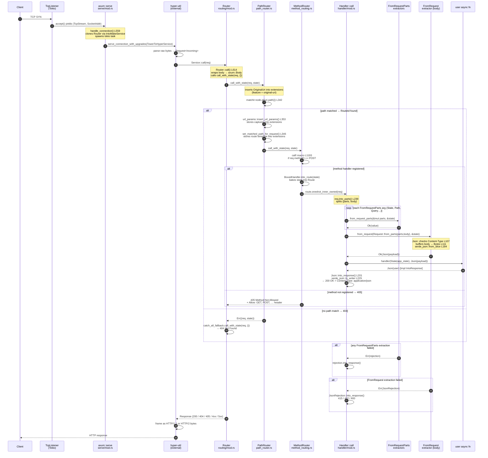

# axum — Sequence Diagram: HTTP Request Lifecycle

Full message sequence for a `POST /users` request handled by
`create_user(State<AppState>, Json<CreateUser>) -> Json<User>`.

Each actor corresponds to a real struct or trait in the axum source tree.

## Actor map

| Actor | File | Line |
|-------|------|------|
| `axum::serve` | `axum/src/serve/mod.rs` | L103, L559 |
| `Router` | `axum/src/routing/mod.rs` | L609, L452 |
| `PathRouter` | `axum/src/routing/path_router.rs` | L325 |
| `MethodRouter` | `axum/src/routing/method_routing.rs` | L1167 |
| `Handler::call` | `axum/src/handler/mod.rs` | L238 |
| `FromRequestParts` | `axum-core/src/extract/mod.rs` | — |
| `FromRequest` (Json) | `axum/src/json.rs` | L99 |
| `IntoResponse` (Json) | `axum/src/json.rs` | L197 |
