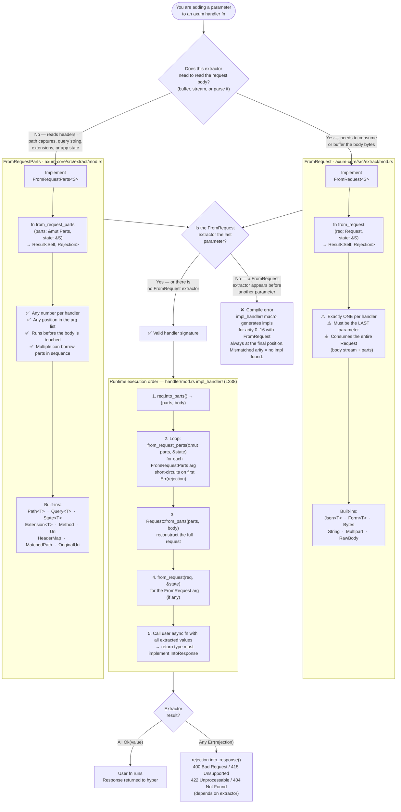

# axum — Extractor Decision Flowchart

How to choose between `FromRequestParts` and `FromRequest` when writing a handler,
and what axum's `impl_handler!` macro enforces at compile and runtime.

---

## Decision Tree



---

## Why the ordering rule exists

`FromRequestParts` takes `&mut Parts` — the borrow checker allows multiple
sequential borrows as long as they don't overlap. The `impl_handler!` macro
generates code that borrows `parts` once per extractor, in declaration order.

`FromRequest` takes ownership of the entire `Request` (which includes the body
`Body` stream). There can only be one owner, and body bytes are consumed
non-reversibly — so only one such extractor can exist, and it must run last
after all `FromRequestParts` extractors are done with `parts`.

## Rejection type contract

Every extractor must declare:

```rust
type Rejection: IntoResponse;
```

This guarantees that any extraction failure can be converted to a valid HTTP
response automatically — no `unwrap`, no panic, no special error-handling glue
in the handler body.

## Custom extractor checklist

| Step | What to do |
|------|-----------|
| 1 | Decide: does it need the body? → choose trait |
| 2 | Define a `Rejection` type that `impl IntoResponse` |
| 3 | `impl FromRequestParts<S>` or `impl FromRequest<S>` |
| 4 | Place the extractor at the correct position in the handler |
| 5 | Optionally add `#[derive(FromRequest)]` via `axum-macros` for struct extractors |
