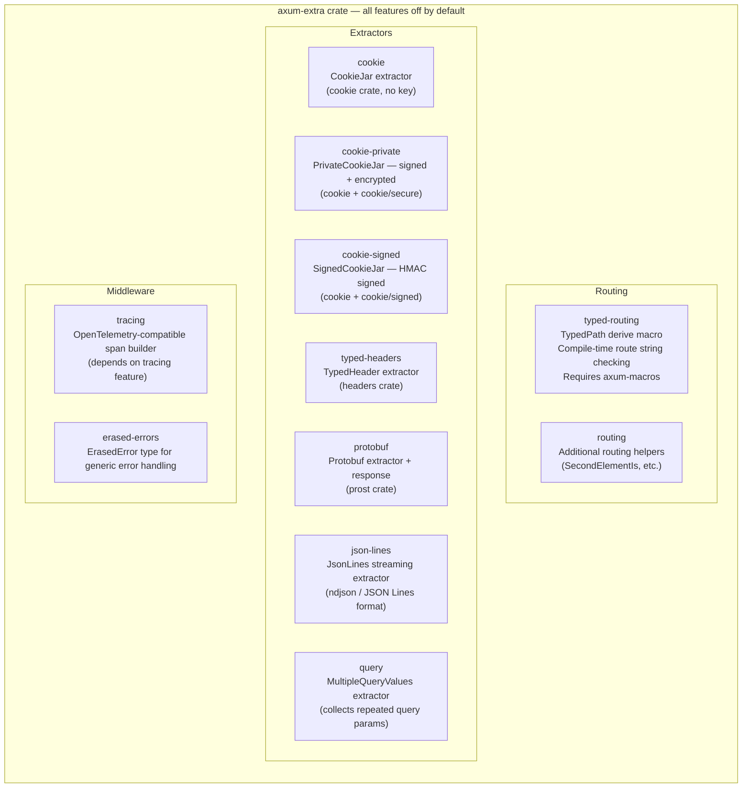
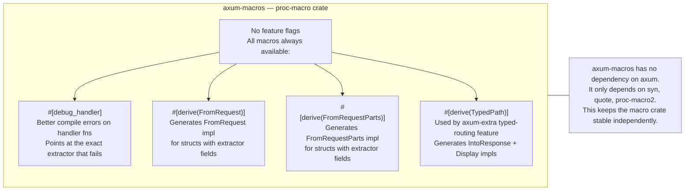
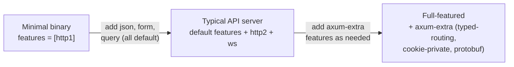

# axum — Feature Flag & Crate Dependency Map

Which Cargo features unlock which capabilities across the four axum workspace crates,
and how those crates relate to each other and to external dependencies.

---

## Crate dependency hierarchy

```mermaid
flowchart TD
    subgraph WORKSPACE["Cargo Workspace — tokio-rs/axum"]
        direction TB

        MACROS["axum-macros  v0.5.1\nProc-macro crate\nNo runtime deps on axum"]
        CORE["axum-core  v0.5.6\nStable trait definitions\nLibrary-author surface"]
        MAIN["axum  v0.8.9\nMain framework crate\nRouter · Extractors · serve()"]
        EXTRA["axum-extra  v0.12.6\nOptional batteries\nAll features are feature-gated"]

        MACROS -->|"uses syn/quote\nno axum dep"| MACROS
        CORE -->|"depended on by"| MAIN
        MAIN -->|"depended on by"| EXTRA
        MACROS -.->|"proc-macro2 bridge"| MAIN
    end

    subgraph EXTERNAL["External Dependencies"]
        direction LR
        TOKIO["tokio  1.44\nAsync runtime"]
        HYPER["hyper  1.4.0\nHTTP/1.1 + HTTP/2"]
        HYPER_UTIL["hyper-util  0.1.4\nTowerToHyperService"]
        TOWER["tower  0.5.2\nService + Layer traits"]
        TOWER_SVC["tower-service  0.3\nService trait"]
        TOWER_LAYER["tower-layer  0.3.2\nLayer trait"]
        TOWER_HTTP["tower-http  0.6.8\nHTTP middleware"]
        MATCHIT["matchit  0.9.2\nRadix tree routing"]
        SERDE["serde  1.0.221\nSerialisation traits"]
        SERDE_JSON["serde_json  1.0.29\nJSON codec"]
        HTTP["http  1.0.0\nRequest/Response types"]
        BYTES["bytes  1.7\nZero-copy buffers"]
    end

    CORE --- TOWER_SVC
    CORE --- TOWER_LAYER
    CORE --- HTTP
    CORE --- BYTES
    CORE --- SERDE

    MAIN --- TOKIO
    MAIN --- HYPER
    MAIN --- HYPER_UTIL
    MAIN --- TOWER
    MAIN --- TOWER_HTTP
    MAIN --- MATCHIT
    MAIN --- SERDE_JSON
```

---

## `axum` feature flags

```mermaid
flowchart LR
    subgraph AXUM["axum crate — Cargo.toml features"]
        direction TB

        DEFAULT["default features:\n· http1\n· json\n· form\n· matched-path\n· original-uri\n· tower-log\n· query"]

        subgraph HTTP_FEATS["HTTP Protocol"]
            HTTP1["http1\nEnables hyper HTTP/1.1 support\n(on by default)"]
            HTTP2["http2\nEnables hyper HTTP/2 support\n(off by default — adds h2 dep)"]
        end

        subgraph EXTRACT_FEATS["Extractors & Responses"]
            JSON_F["json\nEnables Json&lt;T&gt; extractor + response\n(serde_json dep)"]
            FORM_F["form\nEnables Form&lt;T&gt; extractor\n(serde_html_form dep)"]
            QUERY_F["query\nEnables Query&lt;T&gt; extractor\n(serde_urlencoded via serde_html_form)"]
            MULTI["multipart\nEnables Multipart extractor\n(multer dep)"]
            WS_F["ws\nEnables WebSocketUpgrade extractor\n(tokio-tungstenite + sha1 + base64)"]
        end

        subgraph REQUEST_FEATS["Request Metadata"]
            MPATH["matched-path\nEnables MatchedPath extractor\nStores route template string in extensions"]
            ORIGURI["original-uri\nEnables OriginalUri extractor\nPreserves URI before nest() rewrites it"]
        end

        subgraph TRACE_FEATS["Observability"]
            TRACE_F["tracing\nEnables structured log spans\nvia the tracing crate"]
            TOWER_LOG["tower-log\nBridges tower's log crate to tracing\n(on by default)"]
        end

        subgraph MACRO_FEATS["Macros"]
            MACROS_F["macros\nRe-exports debug_handler, FromRequest\nderive macros from axum-macros"]
        end

        DEFAULT -.-> HTTP1
        DEFAULT -.-> JSON_F
        DEFAULT -.-> FORM_F
        DEFAULT -.-> MPATH
        DEFAULT -.-> ORIGURI
        DEFAULT -.-> TOWER_LOG
        DEFAULT -.-> QUERY_F
    end
```

---

## `axum-extra` feature flags

---

## `axum-macros` feature flags

---

## Feature selection guide

| Capability you want | Feature to enable | Crate |
|---------------------|-------------------|-------|
| JSON bodies (`Json<T>`) | `json` (default on) | `axum` |
| HTML forms (`Form<T>`) | `form` (default on) | `axum` |
| File uploads | `multipart` | `axum` |
| WebSockets | `ws` | `axum` |
| HTTP/2 | `http2` | `axum` |
| Typed route paths | `typed-routing` | `axum-extra` |
| Encrypted cookies | `cookie-private` | `axum-extra` |
| Protobuf bodies | `protobuf` | `axum-extra` |
| Structured tracing | `tracing` | `axum` + `axum-extra` |
| Derive extractors | `macros` (axum) | `axum-macros` via `axum` |

---

## Dependency size vs capability tradeoff

