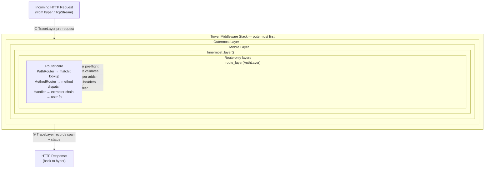
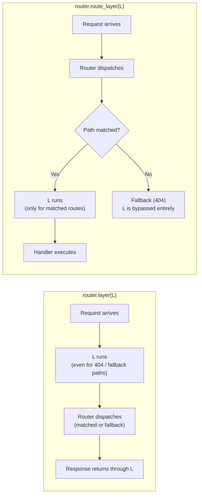
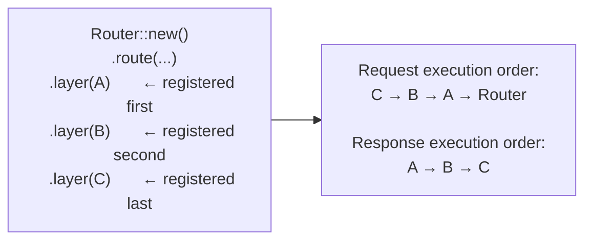
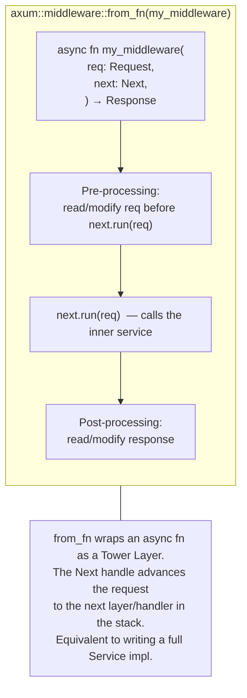

# axum — Middleware Composition & Execution Order

How Tower layers stack around axum's `Router`, in what order they execute,
and how `.layer()` differs from `.route_layer()`.

---

## The Onion Model

Each call to `.layer(L)` wraps the current service in a new outer layer.
**The last `.layer()` call is the outermost layer — the first to see a request.**

---

## `.layer()` vs `.route_layer()` — the critical difference

**Key consequence:** An authentication layer added via `.route_layer()` is
never called for 404 responses, so attackers cannot probe your route structure
through auth failures. An auth layer added via `.layer()` runs on every request
including 404s — useful if you want to hide even the existence of unmatched paths.

---

## Registration order → execution order

`axum` builds the layer stack by calling `ServiceBuilder`-style wrapping:
each new `.layer(L)` call wraps the existing service, so later registrations
end up on the outside.

---

## Built-in `tower-http` layers and where they fit

| Layer | Typical placement | Why |
|-------|-------------------|-----|
| `TraceLayer` | Outermost (`.layer()` last) | Must observe the final HTTP status code, including 404/405 |
| `CorsLayer` | Near outermost (`.layer()`) | Must intercept OPTIONS preflight before routing |
| `CompressionLayer` | Middle (`.layer()`) | Compresses response body regardless of route |
| `TimeoutLayer` | Middle (`.layer()`) | Enforces wall-clock deadline across the whole pipeline |
| `AuthLayer` (custom) | `.route_layer()` if auth is per-route | Skip for 404; use `.layer()` if all paths require auth |
| `ConcurrencyLimitLayer` | Innermost (`.route_layer()`) | Limits concurrency per matched route, not global |

---

## `from_fn` middleware — Tower layer from a plain async fn

---

## Key design invariants

| Invariant | Enforcement |
|-----------|-------------|
| Layers are applied in reverse registration order | Each `.layer()` call wraps the current `Router` via `layer.layer(svc)` |
| `.route_layer()` does not wrap the fallback handler | `route_layer` is stored per-`MethodRouter` and applied only after path matching |
| State must be provided via `.with_state()` before layers can be fully resolved | `BoxedHandler` stores handlers before state is known; `into_route(state)` finalises |
| Middleware errors must be converted to responses | `HandleError` layer bridges `Service::Error` → `IntoResponse` |
